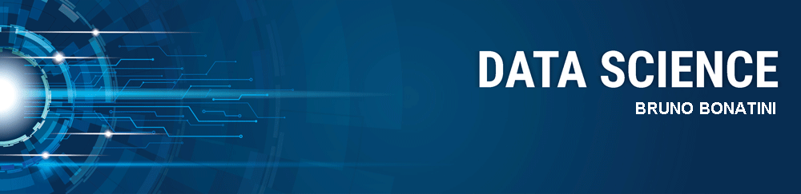

 

  

# Bruno Spagnol Bonatini
*Data Scientist* and Analyst

Sou um Data Scientist apaixonado por transformar dados em insights valiosos para a empresa. Com minhas habilidades em estatística, programação e tecnologia, trabalho na coleta, processamento e análise de grandes quantidades de dados. Estou sempre em constante aprendizado e desenvolvimento para aprimorar minhas habilidades e me tornar um profissional de destaque em minha área.

- Graduação em Sistemas de Informação pela Universade de Mogi das Cruzes

**Background in:** Python, SQL, Power BI, Analytics and Machine Learning

**Links:**
* [LinkedIn](https://linkedin.com/in/bsbonatini/)
* [Medium](https://medium.com/@brunospagnol)
* [Kaggle](https://kaggle.com/brunobonatini)

## Projetos:
Veja os tutoriais publicados do Bruno:

---

